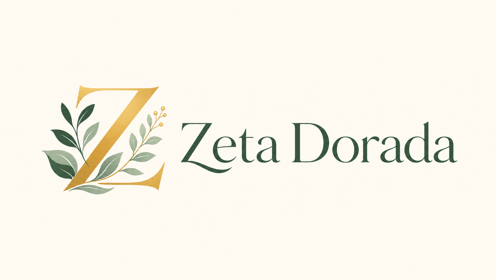
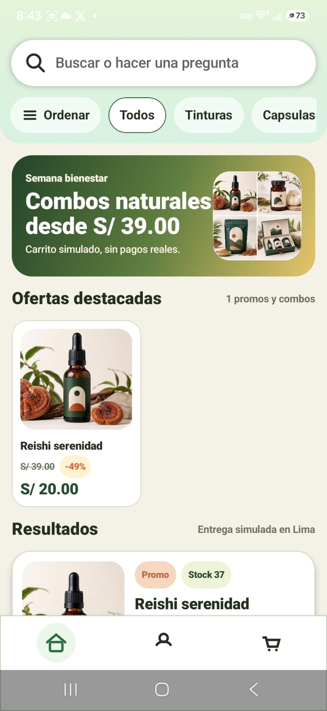
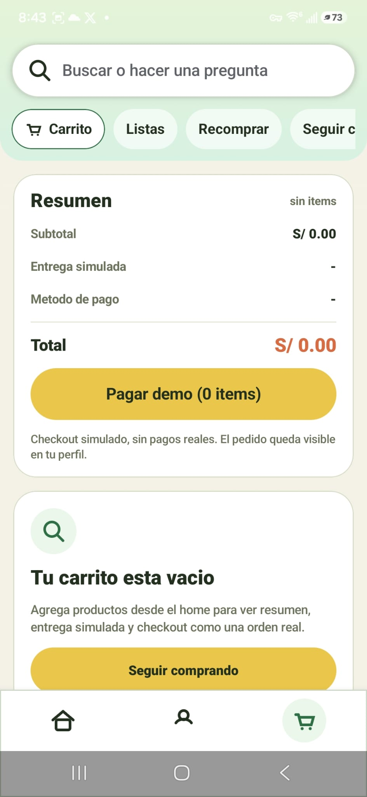

# Zeta Dorada Android



Zeta Dorada is a native Android commerce app for a premium wellness store. The project focuses on a polished mobile shopping experience backed by Supabase data, Firebase Cloud Messaging, and an admin workflow for managing products, promotions, and orders.

## Screenshots

| Home and catalogue | Cart and checkout |
| --- | --- |
|  |  |

## Highlights

- Native Android app built with Kotlin, Jetpack Compose, Material 3, and Gradle Kotlin DSL.
- Product catalogue with search, category filters, sort options, product detail pages, remote images, offers, and stock-aware purchase actions.
- Customer flows for email/password auth, Google OAuth redirect handling, saved products, cart persistence, checkout, addresses, phone validation, and order history.
- Admin experience for product management, promotion banners, order status review, image upload, and push-style order notifications.
- Supabase integration for Auth, profiles, products, promotions, carts, saved items, customer addresses, orders, and admin notifications.
- Firebase Cloud Messaging service for device token registration and admin notification delivery.

## Tech Stack

- Kotlin
- Jetpack Compose
- Material 3
- Android Gradle Plugin
- Supabase REST/Auth APIs
- Firebase Cloud Messaging
- Cloudflare Worker endpoint for image uploads

## Project Structure

```text
android/
  app/
    src/main/java/com/zeta/store/
      MainActivity.kt                    # Compose app shell and user/admin flows
      ZetaFirebaseMessagingService.kt    # FCM token and message handling
      data/                              # Supabase models and client
      ui/theme/                          # Compose theme tokens
    src/main/res/                        # App icons, product assets, and visual resources
  gradle/libs.versions.toml              # Centralized dependency versions
  build.gradle.kts
  settings.gradle.kts
```

## Local Setup

1. Open the `android` folder in Android Studio.
2. Copy `local.properties.example` to `local.properties`.
3. Fill in the required values:
   - `SUPABASE_URL`
   - `SUPABASE_ANON_KEY`
   - `IMAGE_UPLOAD_ENDPOINT`
4. Add your Firebase config:
   - Copy `app/google-services.example.json` to `app/google-services.json`.
   - Replace the placeholder values with a Firebase Android app config for package `com.zeta.store`.
5. Sync Gradle and run the `app` configuration.

## Build

```bash
./gradlew assembleDebug
```

On Windows:

```powershell
.\gradlew.bat assembleDebug
```

## Security Notes

The real `local.properties` and `app/google-services.json` files are intentionally ignored. They contain environment-specific configuration and should not be committed to a public portfolio repository.

## Recruiter Notes

This project demonstrates end-to-end mobile product work: native UI implementation, stateful commerce flows, backend API integration, authentication, admin tooling, push notifications, and production-minded configuration hygiene. The app is intentionally built as a complete vertical slice instead of a static prototype.
